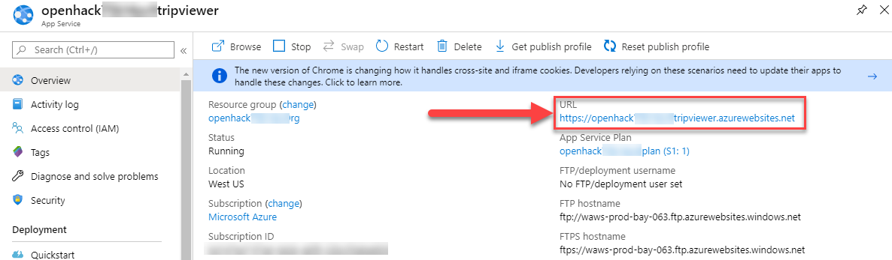
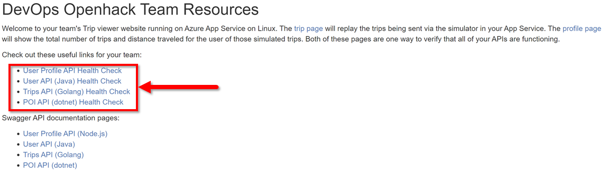

# DevOps OpenHack

During this OpenHack your team will work on the implementation of DevOps practices to achieve Zero Downtime Deployment targeting an application and APIs that are hosted in <a href="https://docs.microsoft.com/azure/app-service/containers/app-service-linux-intro" target="_blank">Azure App Service on Linux</a> which is hosting a series of Linux-based containers.

Any resemblance to actual scenarios, issues, or pain points that you are facing is **not** purely coincidental. The definitions of the challenges that will be presented to you during this event are inspired from real life.

## Context

Your team is the IT team of a fictitious insurance company. The company is offering their customers the ability to evaluate their driving skills. A mobile application collects the data from the car and sends them to a set of APIs which evaluate the trip that has just been completed. Your customers can connect to a web application that uses the same APIs to review their trips and their driving score. Any downtime of the APIs would greatly impact your business.

### **Your mission, should you accept it, is to update the APIs to incorporate any business requirements while keeping the application functional.**

The success of your team depends on your ability to perform those updates and minimize the downtime of your application.

## Architecture

The application is composed of :

- **Tripviewer**: The team website that your customers are using to review their driving scores and trips which are being simulated against the APIs.
- **Trips**: The trips API is where the mobile application sends the trip data from the OBD device to be stored.
- **POI**: The POI (Point Of Interests) API is collecting the points of the trip when a hard stop or hard acceleration was detected.
- **User**: The user profile API is used by the application to read the user's information.
- **User-Java**: The user (Java) API is used by the application to create and modify the users.

A simulator is running throughout the entire event to send to your APIs the data that your users would generate in real life.

The following schema shows the overall architecture:

## Keep the lights up

There is no "maintenance window", your goal throughout this OpenHack is implement a strategy for a zero downtime deployment.

--------------

## Cheat sheet

In this section, you will find a list of commands to help you get started with the technologies used during the DevOps OpenHack.

### Obtaining the credentials of your team environment

1. Navigate to the **VIEW LAB ENVIRONMENT** tab.
2. The usernames and passwords provided can be used to access your Azure subscription.

### Connecting to the team website (Tripviewer)

1. Navigate to the **VIEW LAB ENVIRONMENT** tab.
2. The usernames and passwords provided can be used to access your Azure subscription. (These credentials will be deleted after the event, therefore long term access to resources is not guaranteed)
3. Search for the resource **tripviewer**, or alternatively, browse to <a href="https://portal.azure.com/#blade/HubsExtension/BrowseResource/resourceType/Microsoft.Web%2Fsites" target="_blank">App Services</a> in the <a href="https://portal.azure.com/" target="_blank">Azure portal</a> and locate the App Service that ends with **tripviewer**.
4. Browse to the App Service and note the URL in the **Overview** blade. Clicking the URL will bring up the **Tripviewer** application. For example:

    

The team website is helpful for:

- Homepage links to the four API health check pages
- Homepage links to the four API Swagger UI webpages
- Tripviewer page to see trips being simulated against your team's API through the simulator

### Viewing API health

Each of the four APIs has a known URI to access a health check. The URIs are linked directly from the homepage of **Tripviewer**.

### Connecting to the Jenkins master container

> **Note:** Only required if you are going to complete the challenges using Jenkins

1. Navigate to the **VIEW LAB ENVIRONMENT** tab.
2. The usernames and passwords provided can be used to access your Azure subscription.
3. Search for the resource **jenkins**, or alternatively, browse to [Container instances](https://portal.azure.com/#blade/HubsExtension/BrowseResource/resourceType/Microsoft.ContainerInstance%2FcontainerGroups) in the [Azure portal](https://portal.azure.com/) and locate the container instance that ends with **jenkins**.
4. Browse to the container instance and note the FQDN in the **Overview** blade. Copy the FQDN and append ":8080" to the end of it to access your Jenkins container. For example:

    - [http://openhack[unique]jenkins.[region].azurecontainer.io:8080](http://openhack[unique]jenkins.[region].azurecontainer.io:8080/)

The credentials for the Jenkins deployment are as follows:

- Jenkins username: **demouser**
- Jenkins password: **demo@pass123**

### Database credentials

The existing Azure SQL database credentials are as follows:

- Username: **demousersa**
- Password: **demo@pass123**

## Command line references

The current [Azure CLI version can be found here](https://docs.microsoft.com/cli/azure/install-azure-cli?view=azure-cli-latest) if a suitable version 2.3.0 or later is not already be installed.

## Glossary

Common term definitions

### Azure App Service on Linux

[Azure App Service](https://docs.microsoft.com/azure/app-service/overview) is a fully managed compute platform that is optimized for hosting websites and web applications. Customers can use [App Service on Linux](https://docs.microsoft.com/azure/app-service/containers/app-service-linux-intro) to host web apps natively on Linux for supported application stacks.

### ACR - Azure Container Registry

This is the private registry for Docker containers in Azure. The containers stored in an [Azure Container Registry](https://docs.microsoft.com/azure/container-registry/container-registry-intro) can only be accessed by the resources that have been granted access. As part of the provisioning process of the event, we have granted access for each Azure Web App to the ACR that you are using.

### ACI - Azure Container Instances

[Azure Container Instances](https://docs.microsoft.com/azure/container-instances/container-instances-overview) offers the fastest and simplest way to run a container in Azure, without having to manage any virtual machines and without having to adopt a higher-level service.

Azure Container Instances is a great solution for any scenario that can operate in isolated containers, including simple applications, task automation, and build jobs.

### Docker container

A [container](https://www.docker.com/resources/what-container) is a standard unit of software that packages up code and all its dependencies so the application runs quickly and reliably from one computing environment to another. A Docker container image is a lightweight, standalone, executable package of software that includes everything needed to run an application: code, runtime, system tools, system libraries and settings.

Container images become containers at runtime and in the case of Docker containers - images become containers when they run on Docker Engine (and in the case of this application and its APIs - Docker Engine running in Azure App Service on Linux). Available for both Linux and Windows-based applications, containerized software will always run the same, regardless of the infrastructure. Containers isolate software from its environment and ensure that it works uniformly despite differences for instance between development and staging.
